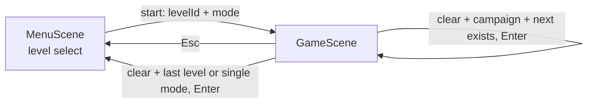

# Neon Trail level format

This document is the contract between three things:

1. the **authored level files** in `src/game/levels/`,
2. the **runtime** (`GameScene`, `MenuScene`, `src/game/logic.ts`), and
3. the planned **Canvas level editor**.

Anything an editor needs to read, render, validate, or write a level is specified here. The
canonical TypeScript types live in [`src/game/types.ts`](../src/game/types.ts) and the canonical
validator lives in [`src/game/levelSchema.mjs`](../src/game/levelSchema.mjs) — this document explains
their meaning; it does not replace them.

---

## 1. File layout

```
src/game/
  types.ts                  # LevelDefinition and friends (single source of truth)
  levelSchema.mjs           # validateLevel() - runtime + editor validation
  logic.ts                  # pure helpers shared by gameplay and tests
  storage.ts                # localStorage: progression mode + best scores
  levels/
    index.ts                # registry: loads, validates and orders every level
    manifest.json           # campaign ordering
    afterglow-alley.json    # one file per level, file name == level id
    mirror-metro.json
  presets/
    neon-food.json          # editor preset only, NOT loaded at runtime
```

**Discovery.** `levels/index.ts` uses `import.meta.glob("./*.json", { eager: true })`, so *every*
`.json` file dropped into `src/game/levels/` (other than `manifest.json`) is loaded and validated.
The editor can add a level by writing one new file — no TypeScript edit is required.

**Ordering.** `manifest.json` controls campaign order only:

```json
{ "version": 1, "campaign": ["afterglow-alley", "mirror-metro"] }
```

Levels present on disk but absent from `campaign` still load and appear in the level select; they
sort alphabetically after the campaign levels. An id in `campaign` with no matching file is a load
failure.

**Failure behaviour.** In dev, any validation or manifest failure throws at import time with a
formatted issue list. In a production build it is logged via `console.error` and the offending
level is skipped, so one bad file cannot take the whole game down.

**Convention:** the file base name must equal the level's `id`. The registry does not enforce this,
but the editor should, so files stay greppable.

---

## 2. Schema reference

All level files are plain JSON — no comments, no trailing commas, no computed values. Every level
is fully self-contained (including its food table), which keeps editor load/save a single-file
operation.

### 2.1 `LevelDefinition` (root)

| Field | Type | Required | Notes |
| --- | --- | --- | --- |
| `version` | `1` | yes | Format version. Must equal `LEVEL_FORMAT_VERSION`. |
| `id` | `string` | yes | Stable, unique, kebab-case. Used as the save key for best scores and in the manifest. Renaming it orphans the stored best score. |
| `name` | `string` | yes | Display name in the level select and HUD. |
| `subtitle` | `string` | yes | One-line flavour text. |
| `grid` | `{ width, height }` | yes | Integer cell counts. `width` 6–64, `height` 6–48. |
| `speedMs` | `number` | yes | Integer milliseconds per movement tick, 60–600. Lower is faster. |
| `initialSnake` | `Point[]` | yes | Head first. ≥2 segments, in bounds, no repeats, orthogonally contiguous, not inside an obstacle. |
| `obstacles` | `ObstacleDefinition[]` | yes | May be empty. |
| `enemies` | `EnemyDefinition[]` | yes | May be empty. |
| `food` | `FoodDefinition[]` | yes | ≥1 entry. |
| `spawns` | `FoodSpawnRule[]` | yes | ≥1 entry, total weight > 0. |
| `objective` | `LevelObjective` | yes | Win condition. |
| `firstPersonEnabled` | `boolean` | yes | Whether `V` toggles the first-person scan view. |

`Point` is `{ "x": number, "y": number }` with integer values. Origin is the **top-left** cell:
`x` grows right, `y` grows **down**.

### 2.2 `ObstacleDefinition`

| Field | Type | Required | Notes |
| --- | --- | --- | --- |
| `id` | `string` | yes | Unique within the level. |
| `kind` | `"wall" \| "crystal"` | yes | Purely cosmetic difference *unless* `breakableInFirstPerson` is set. |
| `position` | `Point` | yes | In bounds, and unique — two obstacles may not share a cell. |
| `breakableInFirstPerson` | `boolean` | no | Only valid on `crystal`. The only way to satisfy a `clear-crystals` objective. |

### 2.3 `EnemyDefinition`

| Field | Type | Required | Notes |
| --- | --- | --- | --- |
| `id` | `string` | yes | Unique within the level. |
| `kind` | `"roller" \| "glitch"` | yes | Cosmetic (teal orb vs pink orb). |
| `position` | `Point` | yes | Starting cell, in bounds. |
| `patrol` | `Point[]` | no | Waypoint cycle. When omitted the enemy oscillates one cell left/right of its start. |
| `edibleAfterFood` | `FoodKind` | no | The enemy is safe to run into only while this is the most recently eaten food *kind*. Must be a kind that exists in this level's `food` array, otherwise the enemy is unkillable. |

### 2.4 `FoodDefinition`

| Field | Type | Required | Notes |
| --- | --- | --- | --- |
| `id` | `string` | yes | Unique within the level. Referenced by `spawns[].foodId` and `objective.foodId`. |
| `kind` | `"spark" \| "prism" \| "pulse" \| "nova"` | yes | The *kind* (not the id) is what `edibleAfterFood` matches against. |
| `color` | `number` | yes | 24-bit RGB as a **decimal integer** (JSON has no hex literal). `0xffdf4a` → `16768842`. Editors should present a colour picker and convert. |
| `growth` | `number` | yes | Integer 0–20. Extra trail segments added when eaten. |
| `score` | `number` | yes | Non-negative integer points. |
| `rarity` | `number` | yes | 0–1. **Presentational/authoring metadata only** — the runtime spawner uses `spawns[].weight`, not `rarity`. |
| `firstPersonOnly` | `boolean` | no | Can only be picked up while the first-person view is active. Requires `firstPersonEnabled: true` to be collectable at all. |

### 2.5 `FoodSpawnRule`

| Field | Type | Required | Notes |
| --- | --- | --- | --- |
| `foodId` | `string` | yes | Must resolve to a `food[].id`. At most one rule per food id. |
| `weight` | `number` | yes | ≥0. Relative probability for untimed spawns. |
| `maxActive` | `number` | yes | Integer ≥1. Hard cap on simultaneously present items of this food. |
| `intervalMs` | `number` | yes | Integer ≥100. A looping timer attempts one spawn of this food at this cadence. |
| `regions` | `Point[]` | no | Allow-list of candidate cells. When omitted, the whole grid is a candidate. |

### 2.6 `LevelObjective`

| Field | Type | Required | Notes |
| --- | --- | --- | --- |
| `type` | `"score" \| "collect" \| "clear-crystals"` | yes | |
| `target` | `number` | yes | Integer ≥1. Points / items / crystals depending on `type`. |
| `foodId` | `string` | for `collect` | Must resolve to a `food[].id`. |
| `requiresFirstPerson` | `boolean` | no | Authoring hint surfaced in the HUD. Incompatible with `firstPersonEnabled: false`. |

---

## 3. Gameplay semantics

How the runtime actually consumes the data. An editor that wants a useful preview must model this.

### 3.1 Movement

- One movement tick every `speedMs` (a looping Phaser timer).
- Input sets a **queued** direction; it is applied at the start of the next tick. A direction that
  is the exact opposite of the current one is rejected (`isOpposite` in `logic.ts`), so the trail
  can never reverse into itself.
- The snake always starts moving `right`, regardless of how `initialSnake` is laid out. Author the
  start so that heading right is survivable.

### 3.2 Collision order (per tick)

The head's target cell is resolved in this exact order:

1. **Bounds / self / obstacle** (`isValidCell`). If the cell is invalid:
   - if it holds a `breakableInFirstPerson` crystal **and** the first-person view is active, the
     crystal is removed and `clearedCrystals` increments — movement continues;
   - otherwise the run ends with *SIGNAL LOST*.
   Self-collision ignores the tail cell when the snake is not currently growing, so following your
   own tail is legal.
2. **Enemy.** If an enemy occupies the cell: eaten for **+300 points** when
   `enemy.edibleAfterFood === lastFoodKind`, otherwise the run ends.
3. **Food.** If food occupies the cell: a `firstPersonOnly` item outside the first-person view is
   left in place and a hint is shown; otherwise it is consumed.

The +300 enemy bounty is a runtime constant, not level data.

### 3.3 Growth and colour

- Eating adds `food.growth` to a pending `growth` counter. On each tick the tail is only removed
  when `growth === 0`, so growth is spread across the following ticks.
- New head segments take the colour of the **most recently eaten food**. Before anything is eaten
  the trail is spark-yellow (`0xffdf4a`) and `lastFoodKind` is `"spark"` — which means a level
  whose first enemy is `edibleAfterFood: "spark"` is edible from the very first tick.

### 3.4 Spawning

Two independent paths put food on the board:

- **Timed:** each `FoodSpawnRule` installs a loop timer at `intervalMs` that tries to spawn *that
  specific* food.
- **Weighted:** two items are spawned at level start via `pickSpawnRule`, which picks a rule with
  probability proportional to `weight`.

Either path then applies the same gate:

1. abort if `maxActive` items of that food are already present;
2. candidate cells = `regions` if present, else every cell in the grid;
3. filter out cells occupied by the snake, existing food, enemies or obstacles, or out of bounds;
4. pick uniformly at random from what remains.

A rule whose `regions` are entirely blocked simply never spawns — there is no fallback.

### 3.5 First-person view

- `V` toggles it, only when `firstPersonEnabled` is `true` and the level has not ended.
- It is a raycast-free projection: objects within 18 cells ahead and ±6 cells laterally of the head
  are drawn scaled by distance. It is a *gameplay* mode, not just a camera: it is the only way to
  break crystals and the only way to collect `firstPersonOnly` food.

### 3.6 Objective evaluation

Checked after every tick:

| `type` | Condition |
| --- | --- |
| `score` | `score >= target` |
| `collect` | `collectedFood[foodId] >= target` |
| `clear-crystals` | `clearedCrystals >= target` |

`requiresFirstPerson` is **not** enforced by this check — it only changes HUD copy. For
`clear-crystals` the first-person requirement is enforced implicitly, because crystals can only be
broken in that view.

---

## 4. Level lifecycle and sequencing



### 4.1 Scene data contract

`MenuScene` starts the game with exactly:

```ts
this.scene.start("game", { levelId: string, mode: "campaign" | "single" });
```

`GameScene.init()` is defensive: an unknown `levelId` falls back to the first level, and any mode
other than `"single"` is treated as `"campaign"`. Score is always zeroed on entry from the menu.

### 4.2 Per-level reset

`startLevel(levelId, startingScore)` deep-copies `initialSnake`, `obstacles` and `enemies` from the
definition so gameplay mutation (breaking crystals, eating enemies) never edits the loaded level
data. Definitions are treated as immutable at runtime — important, because the editor will hold a
reference to the same objects.

### 4.3 End states

| Outcome | `endAction` | Enter does |
| --- | --- | --- |
| Failed (wall, self, enemy) | `retry` | Restart the same level. Campaign keeps the running score; single mode resets to 0. |
| Cleared, campaign, next level exists | `next` | Start the next campaign level, **carrying the score forward**. |
| Cleared, campaign, last level | `menu` | Return to the level select. |
| Cleared, single mode | `menu` | Return to the level select. |

`Esc` always returns to the level select. The overlay shows the run score plus the stored best.

### 4.4 Persistence

`src/game/storage.ts`, `localStorage`, all writes guarded against quota/privacy failures:

| Key | Shape | Meaning |
| --- | --- | --- |
| `neon-trail.progressionMode` | `"campaign" \| "single"` | Level-select toggle (`M`). Defaults to `campaign`. |
| `neon-trail.bestScores` | `{ [levelId]: number }` | Best score per level, written on every end state. Shown on the level cards. |

Levels are **never locked** — every level is playable from the start, which keeps editor-authored
levels immediately testable.

---

## 5. Validation rules

`validateLevel(input: unknown): ValidationResult` is the single validation entry point. It returns
either `{ ok: true, level }` (a fully narrowed `LevelDefinition`) or `{ ok: false, issues }`. It
collects **all** issues rather than failing on the first, so an editor can highlight every bad field
in one pass.

```ts
interface ValidationIssue {
  path: string;      // e.g. "obstacles[2].position", "spawns[0].foodId"
  code: ValidationCode;
  message: string;   // human-readable, safe to show directly
}
```

`path` is a document path into the JSON, so the editor can map an issue straight onto the control
that produced it.

| Code | Raised when |
| --- | --- |
| `not-an-object` / `invalid-type` | A value has the wrong JSON type. |
| `missing-field` | A required field is absent (e.g. `collect` without `foodId`). |
| `invalid-value` | Correct type but out of range or nonsensical (speed, grid size, `breakableInFirstPerson` on a wall, all-zero spawn weights). |
| `unsupported-version` | `version` is not `1`. |
| `duplicate-id` | Repeated id within `food` / `obstacles` / `enemies`, or two spawn rules for one food. |
| `unknown-reference` | `spawns[].foodId`, `objective.foodId`, or `enemies[].edibleAfterFood` points at something the level does not define. |
| `out-of-bounds` | A cell lies outside the grid (obstacle, enemy, patrol point, spawn region, snake segment). |
| `not-contiguous` | `initialSnake` segments are not orthogonally adjacent. |
| `overlap` | Two obstacles share a cell, the snake repeats a cell, or the snake starts inside an obstacle. |
| `unsolvable-objective` | `clear-crystals` target exceeds the number of breakable crystals. |

Use `formatIssues(issues)` for a readable multi-line dump (this is what the registry logs).

---

## 6. Authoring invariants and balance guidance

Not machine-enforced, but worth surfacing as editor warnings:

- **Right-facing start.** The snake always begins moving right; leave at least a few free cells
  ahead of the head.
- **Reachable objectives.** A `score` target should be plausibly reachable given the available food
  values and `maxActive` caps. A `collect` target should not exceed what the spawner can realistically
  produce.
- **Spawn space.** If every rule uses `regions` and those cells are walled in, the level stalls.
- **Enemy fairness.** An enemy with `edibleAfterFood` pointing at a food that spawns rarely (low
  weight, long `intervalMs`) is effectively a permanent wall.
- **`firstPersonOnly` food** in a level with `firstPersonEnabled: false` is uncollectable dead data.
- **Speed.** 120–200 ms is the comfortable band; below ~100 ms the grid gets hard to read.

---

## 7. Editor contract

This section is the contract the level editor implements. The shipped implementation lives in
`.github/extensions/level-editor/` — see §7.6.

### 7.1 Read path

1. Read `manifest.json` for campaign order, and every other `*.json` in `src/game/levels/`.
2. `validateLevel(parsed)` on each. Render valid levels; surface issues inline for invalid ones
   using `issue.path`.
3. Draw the grid from `grid.width` / `grid.height`, then overlay obstacles, enemies, the starting
   trail (head highlighted), and any `regions` overlays from spawn rules.

### 7.2 Write path

1. Mutate an in-memory document — never a loaded `LevelDefinition` instance, which the runtime
   treats as immutable.
2. `validateLevel` **before** saving. Refuse to write a document with any issue.
3. Serialize through `serializeLevel()` from `.github/extensions/level-editor/levelStore.mjs`. It
   applies `orderLevelKeys()` for a **stable key order** matching the shipped files (`version, id,
   name, subtitle, grid, speedMs, firstPersonEnabled, initialSnake, obstacles, enemies, food,
   spawns, objective`), then pretty-prints in the hand-authored house style: arrays put one element
   per line, and any object whose subtree contains no array stays on a single line (so
   `{ "x": 12, "y": 4 }` and a whole food row each stay on one line). Plain
   `JSON.stringify(doc, null, 2)` would explode every point onto three lines and make editor saves
   produce huge whitespace-only diffs against hand-written files.
4. Omit optional fields entirely rather than writing `null` or `false` — the shipped files do, and
   `validateLevel` treats `undefined` and absent identically.
5. Write to `src/game/levels/<id>.json`; add the id to `manifest.json.campaign` if it belongs to the
   campaign. A rename moves the file and keeps the campaign slot.

### 7.3 Round-trip fidelity

Two guarantees, both asserted in `src/game/levels.test.ts`:

- **Semantic.** `validateLevel` returns a **normalized copy**, not the input object. For any valid
  document, `JSON.parse(JSON.stringify(validateLevel(doc).level))` deep-equals `doc`, so load → save
  is lossless.
- **Byte-level.** `serializeLevel(JSON.parse(file))` reproduces every shipped level file exactly.
  Opening a level and saving it unchanged produces an empty diff.

### 7.4 Versioning and migration

`version` is a single integer for the whole document. Policy:

- Additive, optional fields **do not** bump `version`.
- Removing a field, renaming it, or changing its meaning **does** bump `version`.
- On a bump, `levelSchema.mjs` gains a migration step that upgrades older documents to the current
  shape before validation, and `LEVEL_FORMAT_VERSION` is raised. Documents newer than the running
  build are rejected with `unsupported-version` rather than guessed at.
- The editor always writes the current `LEVEL_FORMAT_VERSION`.

### 7.5 Minimum tool palette

| Tool | Edits |
| --- | --- |
| Grid resize | `grid.width`, `grid.height` (must re-validate every cell reference) |
| Paint wall / crystal, with a breakable flag | `obstacles[]` |
| Place / move enemy, kind picker, `edibleAfterFood` picker, patrol path drawing | `enemies[]` |
| Draw starting trail (head → tail) | `initialSnake[]` |
| Food table: kind, colour picker, growth, score, `firstPersonOnly` | `food[]` |
| Spawn rules: weight, `maxActive`, `intervalMs`, optional region painting | `spawns[]` |
| Objective picker with type-dependent fields | `objective` |
| Level meta: id, name, subtitle, speed, first-person toggle | root fields |
| Campaign ordering (drag to reorder) | `manifest.json` |
| Validate + Play (launch `GameScene` with this level id) | — |

### 7.6 The shipped editor

The editor is a Copilot **canvas extension** at `.github/extensions/level-editor/`:

| File | Role |
| --- | --- |
| `extension.mjs` | Declares the `level-editor` canvas, runs one loopback HTTP server per open panel, exposes the JSON API and the agent-facing actions. |
| `levelStore.mjs` | All file IO: list/read/save/delete, `manifest.json` rewrites, `serializeLevel()`, and the new-level template. |
| `ui/index.html`, `ui/editor.css`, `ui/editor.js` | The iframe app: level list, grid canvas with a tool palette, inspector, and live validation. |

Key properties:

- **It writes real files.** Every save produces an ordinary `src/game/levels/<id>.json` in the
  working tree. There is no private editor store and no export step — you commit the result and
  open a PR exactly as you would for a hand-edited level.
- **One validator, no drift.** The extension imports `src/game/levelSchema.mjs` directly, so the
  editor, the game, and the test suite all enforce the same rules. `saveLevel()` refuses to write a
  document with any validation issue, so a file on disk is always loadable.
- **Validation is live.** The iframe re-validates on every edit (debounced) and lists each issue
  with its `issue.path`; clicking an issue highlights the offending cell on the grid.
- **Agent actions.** `list_levels`, `open_level`, `read_level`, `create_level`, `save_level`,
  `validate_level`, `delete_level`, `set_campaign_order` — so levels can also be built or fixed
  conversationally, with the panel following along over SSE.

Tool palette shortcuts: `v` select, `1` wall, `2` crystal, `3` breakable crystal, `4` roller,
`5` glitch, `6` snake, `7` patrol, `8` spawn region, `0` erase, `Cmd/Ctrl+S` save.

---

## 8. Worked example

`src/game/levels/afterglow-alley.json`, annotated:

```jsonc
{
  "version": 1,
  "id": "afterglow-alley",              // file name matches; also the best-score key
  "name": "Afterglow Alley",
  "subtitle": "Ease into the current",
  "grid": { "width": 24, "height": 15 },
  "speedMs": 160,                       // relaxed tempo for the opening level
  "firstPersonEnabled": true,
  "initialSnake": [                     // head first, pointing right, clear runway ahead
    { "x": 7, "y": 8 }, { "x": 6, "y": 8 }, { "x": 5, "y": 8 }
  ],
  "obstacles": [                        // decorative banks, no crystals in this level
    { "id": "left-bank",    "kind": "wall", "position": { "x":  2, "y":  3 } },
    { "id": "left-bank-2",  "kind": "wall", "position": { "x":  2, "y":  4 } },
    { "id": "right-bank",   "kind": "wall", "position": { "x": 21, "y": 11 } },
    { "id": "right-bank-2", "kind": "wall", "position": { "x": 21, "y": 12 } }
  ],
  "enemies": [
    // safe to eat only right after a "pulse" - which has its own spawn rule below
    { "id": "dizzy", "kind": "roller", "position": { "x": 17, "y": 5 }, "edibleAfterFood": "pulse" }
  ],
  "food": [
    { "id": "spark", "kind": "spark", "color": 16768842, "growth": 1, "score":  50, "rarity": 1    },
    { "id": "prism", "kind": "prism", "color":  3598079, "growth": 2, "score": 120, "rarity": 0.7  },
    { "id": "pulse", "kind": "pulse", "color": 16732120, "growth": 3, "score": 220, "rarity": 0.35 },
    // nova has no spawn rule here, so it never appears - it exists so the palette
    // stays consistent across levels and the editor can enable it with one rule
    { "id": "nova",  "kind": "nova",  "color": 10320895, "growth": 4, "score": 400, "rarity": 0.15,
      "firstPersonOnly": true }
  ],
  "spawns": [
    { "foodId": "spark", "weight": 5, "maxActive": 2, "intervalMs": 1900 },
    { "foodId": "prism", "weight": 3, "maxActive": 1, "intervalMs": 2900 },
    { "foodId": "pulse", "weight": 1, "maxActive": 1, "intervalMs": 4500 }
  ],
  "objective": { "type": "score", "target": 900 }   // ~8 sparks, or a handful of prisms
}
```

Note the JSONC comments above are for this document only — the real file is strict JSON.
